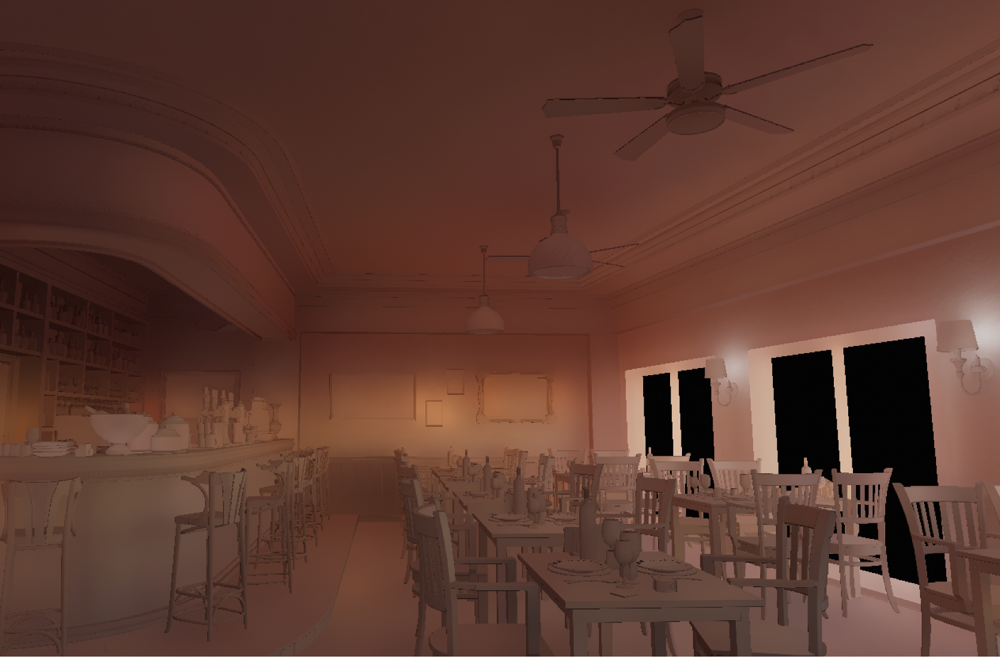

# Chord - 现代vulkan渲染引擎

一个现代风格的Vulkan渲染器，里面试验了许多现代图形渲染技术（包含UE5中流行的Nanite与Lumen）。

0. GPU Scene与Full Bindless资源系统。 
1. **大世界坐标支持。**
2. **完整的广色域渲染管线（ACEScg）。**
3. Lumen风格的Radiance Cache与Screen Probe Gather GI(Diffuse & Specular).
    
    
4. [Nanite风格的无缝网格LOD渲染。](https://qiutang98.github.io/post/%E5%AE%9E%E6%97%B6%E6%B8%B2%E6%9F%93%E5%BC%80%E5%8F%91/mynanite01_mesh_processor/)
    
5. 混合Cached CSM与SDSM阴影系统。
6. [更快更好的Cached Cascade Shadow Map与PCSS。](https://qiutang98.github.io/post/%E5%AE%9E%E6%97%B6%E6%B8%B2%E6%9F%93%E5%BC%80%E5%8F%91/fasterpcss/)
    